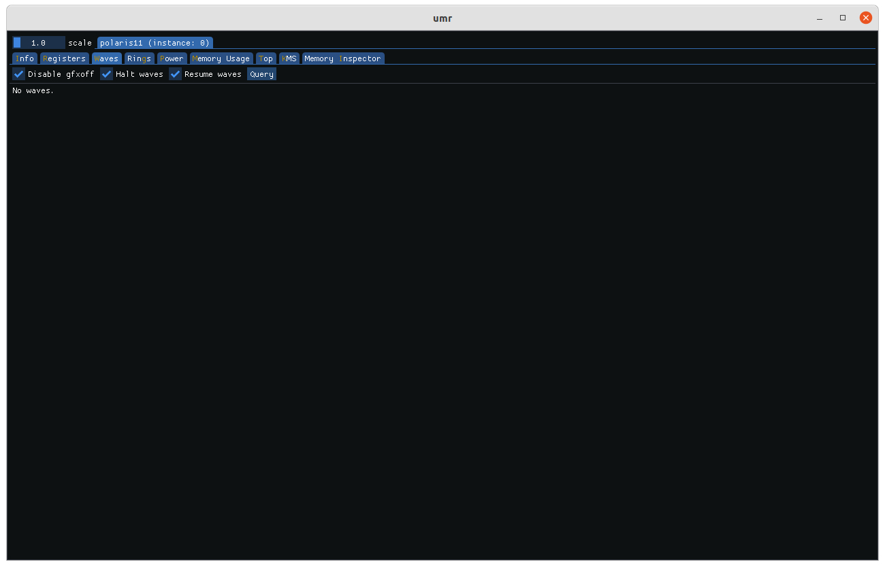

========================
Graphical User Interface
========================

UMR now comes with a GUI component that can be initialized with the *--gui* command:

::

	$ umr --gui

The landing page describes by default the 0th ASIC found with a variety of parameters and features.

The topmost tab is where all of the detected ASICs are displayed.  Below the ASIC tabs are the workpage tabs.
The default tab that opens is the info tab which display information about the ASIC such as firmware version, ring names,
memory configuration etc.

---------------
Register Access
---------------

The register page allows access to registers per IP block.  Alternatively,
they can be searched for using the register name and field name text
areas.

UMR lists the IP blocks available which can be clicked on to expand their
list of registers available.  Registers can be read by clicking on them which
adds them to the view.

Registers in the view can be auto refreshed by clicking on the auto-refresh box and setting
the interval.

-----------
Wave Status
-----------

Reading wave status is accomplished on the *Waves* tab.

By clicking the query button active waves can be displayed.  Checking
'disable gfxoff' will ensure that the power saving feature GFXOFF does not
interrupt reading registers.

Once waves are queried they are listed by order of which waves are active.  The various
status registers can be displayed by expanding their fields, if a shader is
found it can be display in the right half by clicking 'view shader'.

The highlighted line in the shader output represents the PC address for that particular
wave at the time of the wave data was captured.

-------------
Reading Rings
-------------

Reading rings is accomplished on the *Rings* tab.

The 'Limit to rptr/wptr' option is checked by default since normally reading
outside that range leads to undefined behaviour.  You can read outside it
by unchecking the box.

.. image:: umr_gui_rings_page1.png

The initial reading tab shows the contents of the ring buffer itself.  By default
between the RPTR and WPTR.  The raw values as well as the decoding of the ring
are presented.  Tabs are added to the right if indirect buffers (IBs) or
shader programs are found.

.. image:: umr_gui_rings_page2.png

Indirect buffer objects can be decoded as well.  The offset from the
start of the object is presented along with the raw values in order
to aid in debugging.

Shaders if found are presented in their own tabs named after the
GPUVM address they were found at.

------------
Power Status
------------

The current power status of the ASIC can be viewed on the power tab.
The actual types of sensors available vary per ASIC.  The tab graphs
the various sensors over time.

The different DPM profiles can be selected with the radio buttons on
the left.

--------
ASIC Top
--------

Monitoring of various graphics hardware blocks is available on the
tab named 'Top'.  The various blocks monitored by the GRBM_STATUS register
are bar graphed on the left.  Green indicates low activity, yellow moderate,
and red coloured bars indicating heavily busy blocks.  On the right
the number of fences per second are graphed.  The various types of
IP blocks that emit fences are grouped together by colour.

--------------
KMS Monitoring
--------------

The KMS tab visualizes how different framebuffer objects map (if at all)
to display hardware and ultimately display connectors.

------------
Memory Usage
------------

GPU VRAM usage can be visualized on the 'memory usage' tab.  The tab
breaks down used VRAM, GTT, and visible VRAM.

Usage of individual applications can be viewed by clicking on their
pid.

---------------------
Reading GPU VM memory
---------------------

GPU virtual and linear memory can be accessed on the 'Memory Inspector'
tab.  A linear (non-virtual) address can be specified by checking the
linear box otherwise a VMID can be specified.  Like command line umr
the upper 8 bits of of the VMID can be used to specify a hub.

The address and size of the block to inspect are next with the
address specified in hexadecimal and the size in decimal.

